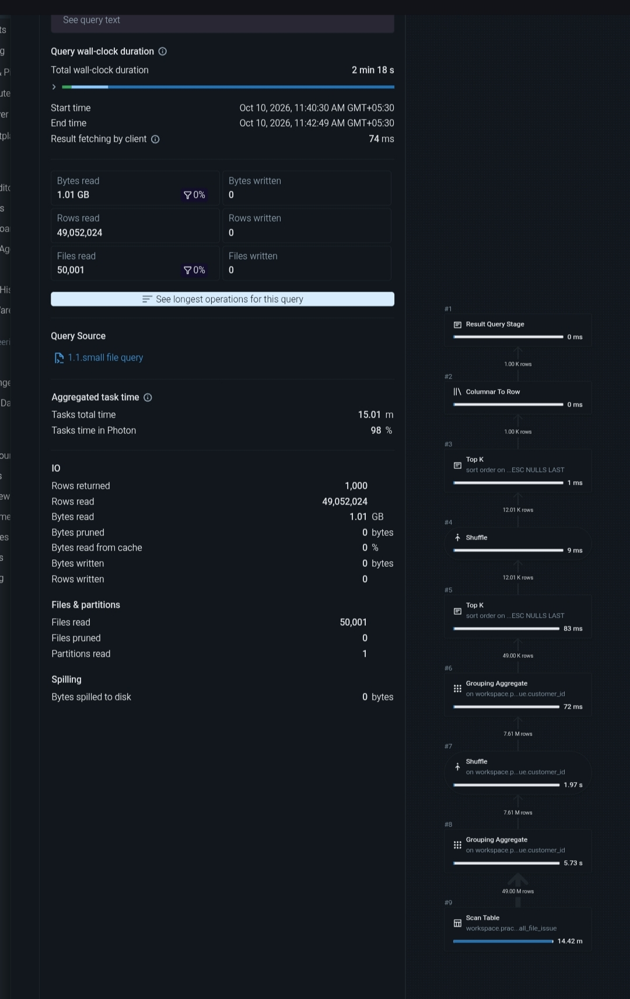
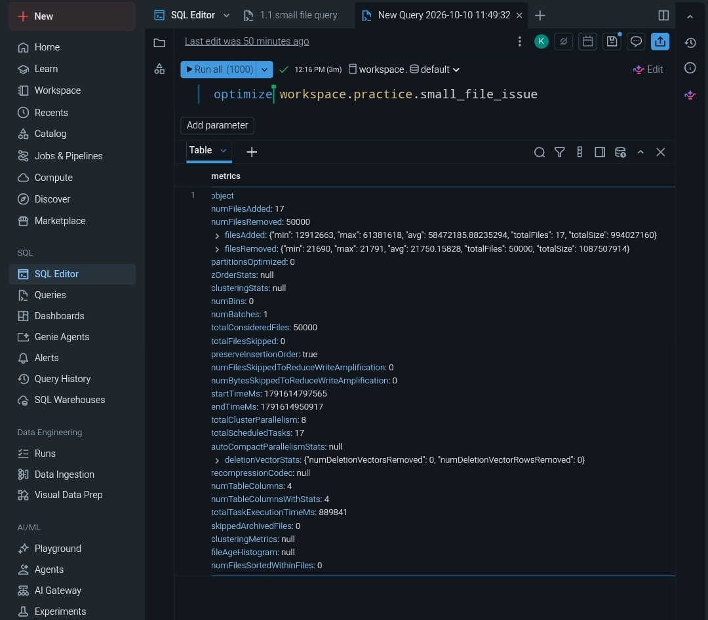
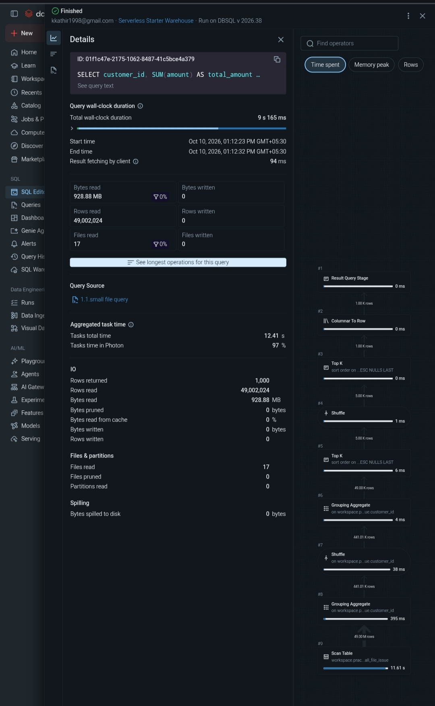

# Databricks Slow Query Troubleshooting

Diagnosed and optimized a slow Delta Lake query caused by ineffective data skipping.

## Architecture

Delta Table → SQL Query → Query Profile → Diagnose → OPTIMIZE → Verify

## Tech Stack

- Databricks Serverless
- Delta Lake
- Spark / Photon
- Databricks SQL

## Key Features

- Used Query Profile to identify scan bottlenecks.
- Analyzed files read, files pruned, rows scanned, and bytes read.
- Used `OPTIMIZE` to improve Delta table layout.
- Verified query improvement from ~2min 18s to ~9s.

## Challenges & Solutions

- **Problem:** Query scanned unnecessary data with no file pruning.  
  **Fix:** Used Query Profile to identify the scan issue and applied `OPTIMIZE`.

## Current Status / Roadmap

- ✅ Slow query reproduced
- ✅ Root cause investigated
- ✅ `OPTIMIZE` applied
- ✅ Performance improvement verified

## Performance Comparison

### Before Optimization

### Optimization

### After Optimization

